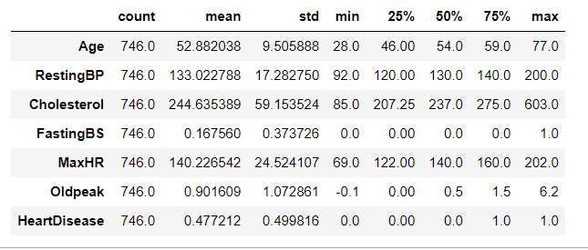
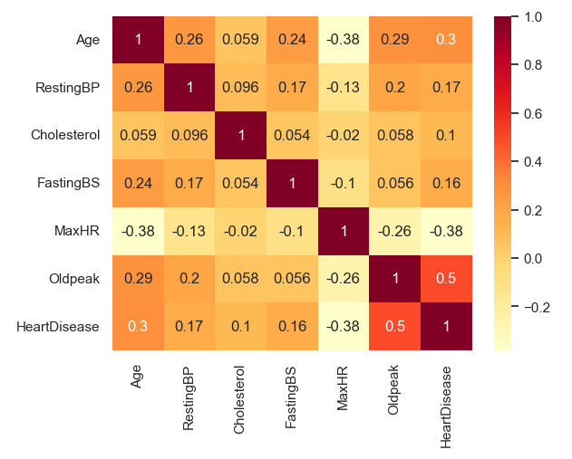
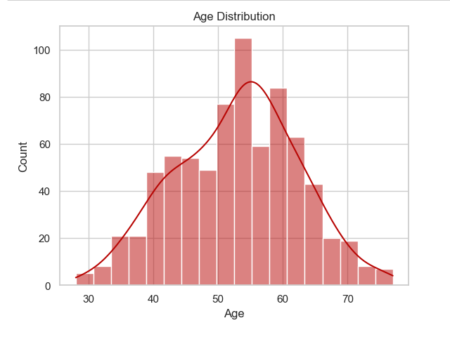
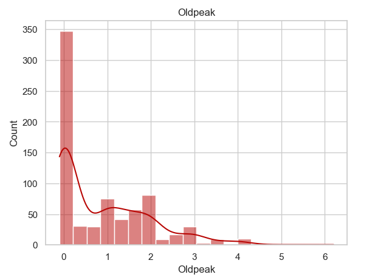
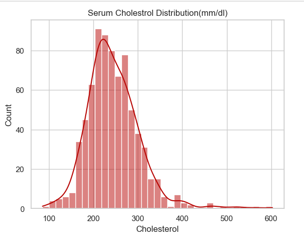

# Heart Failure Prediction Data Analysis  
The dataset for this project is from Kaggle
> [Kaggle dataset](https://www.kaggle.com/datasets/fedesoriano/heart-failure-prediction)  

## Notebook Content:

- **Step 1**: Install and import necessary libraries
- **Step 2**: Reading and exploring data
- **Step 3**: Data cleaning and preprocessing
- **Step 4**: Descriptive Statistics
- **Step 5**: Data Analysis and visualization
- **Step 6**: Predictive models  

### Libraries needed:
- pandas
- matplotlib
- seaborn
- plotly.express and plotly.graph_objects
- numpy
- scipy.stats
- sklearn - linear regression, logistic regression, train_test_split, Decision tree classfier.  

### Step 1: Install and import necessary libraries  
We need to install / import the necessary libraries needed for out data analysis.

### Step 2: Reading and exploring data  

1. Then we will read the csv file downloaded from Kaggle and read it into jupyter notebook using `pd.read_csv`  
The attributes of the data set are as follows:  
    - Age: age of the patient [years]
    - Sex: sex of the patient [M: Male, F: Female]
    - ChestPainType: chest pain type [TA: Typical Angina, ATA: Atypical Angina, NAP: Non-Anginal Pain, ASY: Asymptomatic]
    - RestingBP: resting blood pressure [mm Hg]
    - Cholesterol: serum cholesterol [mm/dl]
    - FastingBS: fasting blood sugar [1: if FastingBS > 120 mg/dl, 0: otherwise]
    - RestingECG: resting electrocardiogram results [Normal: Normal, ST: having ST-T wave abnormality (T wave inversions and/or ST elevation or depression of > 0.05 mV), LVH: showing probable or definite left ventricular hypertrophy by Estes' criteria]
    - MaxHR: maximum heart rate achieved [Numeric value between 60 and 202]
    - ExerciseAngina: exercise-induced angina [Y: Yes, N: No]
    - Oldpeak: oldpeak = ST [Numeric value measured in depression]
    - ST_Slope: the slope of the peak exercise ST segment [Up: upsloping, Flat: flat, Down: downsloping]
    - HeartDisease: output class [1: heart disease, 0: Normal]  
2. Next we will look at the shape and information of our dataset.
    - Our dataset consists of 918 rows and 12 columns.
    - Here is what our data info looks like: 
      

### Step 3: Data cleaning and preprocessing  
1. Moving on, we will check for out null values and duplicated values.
2. I found some inconsistencies in our data for `serum_cholesterol` feature which had the value of 0 for 172 rows, which isn't possible since there can't be a 0 for serum cholesterol.
3. This is the same case for RestingBP but it only has 1 row with a 0 value.
4. Since serum cholesterol is a significant to our analysis, we can drop the rows with 0 values. Same with `RestingBP`.

### Step 4: Descriptive Statistics  
Now that our dataset is clean, we will get into some statistical analysis.
1. Here is the summary statistics of our data set :
  
    - From the above image we can note deduce that the average age of our dataset is 53 with a median of 54 and a standard deviation of 9.5. We can also see that the youngest person from our dataset is 28 and the oldest person is 77. 
    - Similarly we can look at other features of our dataset and note their statistical significance.  

2. Now lets look at the correlation between our features:  
  
    - The highest correlation of our target variable is with `Oldpeak` and the lowest correlation is with `MaxHr` which is actually a negative value.
    - `Cholesterol` and `Age` have the next highest correlation with target variable.  

### Step 5: Data Analysis and visualization  

Now lets look at some visualizations from our dataset.
1. I first started by diving my features into categorial and numerical, then I plotted them into count plots and distribution plots.
2. Here is a distribution plot for `Age`  
  
    - Here we see a right skewed distribution. 
    - The majority of people from our dataset lies in age group between 60-70.  
3. Lets look at a distribution plot for `OldPeak`  

    - `Old Peak` is a sign of damage to the heart muscle, the higher the value, the more damage to the heart muscle.
    - For our dataset, the peak at 0 indicates that more than 300 do not have heart damage and around 80 have moderate damage with the value of 2.
    - we can use this to identify those who are at risk for heart disease.  
4. Lets look at serum cholesterol distribution.

    - We all are aware that according to research high cholesterol is a risk factor for heart diseases.
    - The normal range for serum cholesterol is less than 200 mg/dl, borderline high is between 200 to 239 mg/dl and high is above 240 mg/dl  
    [Source]("https://www.hopkinsmedicine.org/health/treatment-tests-and-therapies/lipid-panel#:~:text=Here%20are%20the%20ranges%20for,or%20above%20240%20mg%2FdL")  
    - In our distribution plot, the peak is at around 200 mg/dl which indicates a normal range.
    - Those who have a serum cholesterol higher than 200 mg/dl which from our distribution plot is a small number of people, they are at risk for heart disease.